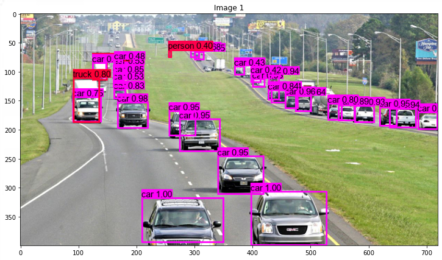

#  Object Detection
Locate and classify objects in an image or video with a *YoloV3* neural network. This model has been **deployed** through a [web app](https://share.streamlit.io/real-veersandhu/object-detection/app.py) and hosted with Streamlit Cloud.

This project was built in conjuction with [Inspirit AI](https://www.inspiritai.com/)!

  

# Summary
This project employs the usage of a YoloV3 neural network that is capable of locating and classifying objects in visual data. YoloV3 (You Only Look Once) is a real time object detection algorithm that identifies objects in videos and images in real time. Yolo has the advantage over traditional CNNs of being faster and still maintaining high accuracy.

The YoloV3 model reads the whole image at test time so predictions are informed by the global context of the data. Yolo also scores regions based on their similarities to one of the predefined classes.

The YoloV3 model first separates images into a grid and each grid cell predicts the number of boundary boxes on objects that scored highly.

Each boundary box has a confidence score representing how accurate it assumes a prediction. The boundary boxes are generated by clustering the dimensions of the boxes from the original dataset to find the most common sizes.

The YoloV3 model contains a total of 252 layers and 62,001,757 parameters.

# Accolades
**1st place** in Inspirit AI's project fair (recognized by industry professonials from Stanford, MIT, and Harvard)
