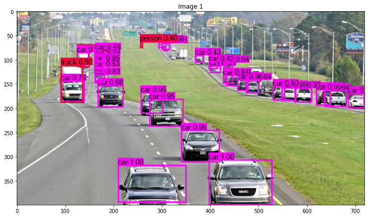

#  Object Detection
Locate and classify objects in an image or video with a *YoloV3* model. The project has been **deployed** as a [web app](https://share.streamlit.io/real-veersandhu/object-detection/app.py) and hosted with Streamlit Cloud.

