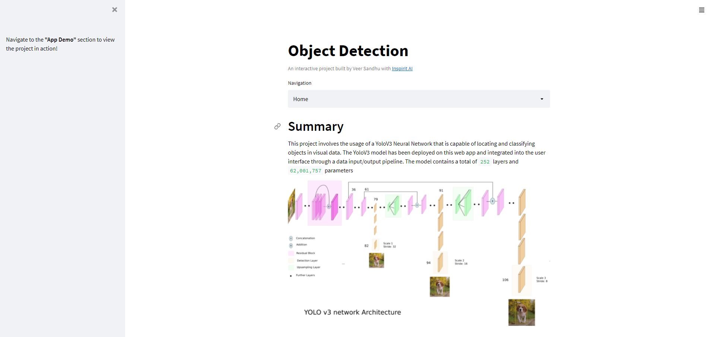

#  Object Detection
Locate and classify objects in an image or video with a *YoloV3* model. The project has been **deployed** as a [web app](https://share.streamlit.io/real-veersandhu/object-detection/app.py) and hosted with Streamlit Cloud.

<iframe src="https://giphy.com/embed/H3TVOD47CxgGASLCq7" width="100%" height="100%" style="position:absolute" frameBorder="0" class="giphy-embed" allowFullScreen></iframe>

<a href="https://giphy.com/gifs/H3TVOD47CxgGASLCq7">via GIPHY</a>

